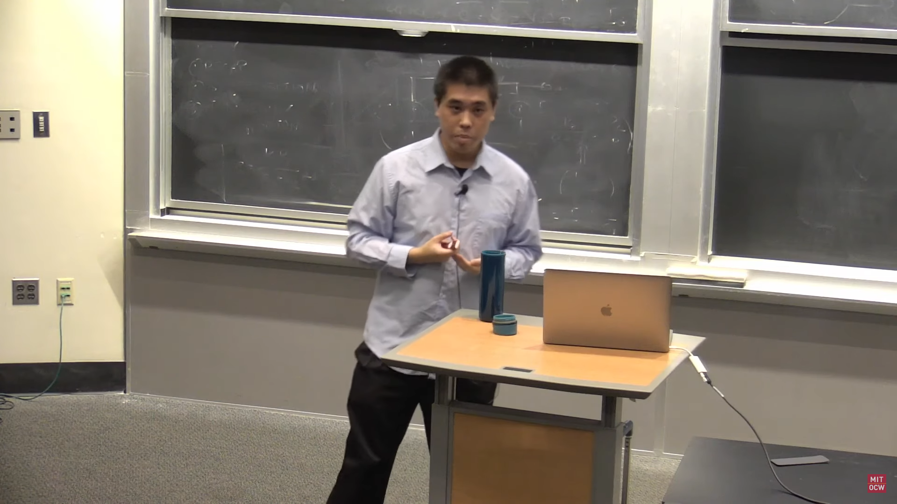

# Bit Hack Swap

* [Introduction](#introduction)
    + [MIT OpenCourseWare!!!](#mit-opencourseware)
* [The C++ Way to Do Things](#the-c-way-to-do-things)
* [x86_64 Assembly BitHack Swap](#x86_64-assembly-bithack-swap)
    + [The Magic Trick](#swapping-values-via-xor)
    + [Truth Table](#truth-table)
* [Unit Testing](#unit-testing)

---
 

## Introduction

### MIT OpenCourseWare!!!

This project is the result of an MIT Open Courseware Lecture, done by Julian Shun, in the Fall of 2018. 
In the video, around 16:30, he beigins to describe the traditional process of swapping values.

---

## The C++ Way to Do Things...

Let's say, we have an X and a Y.

If we were to swap these traditionally, say in C++, it would look something like this:

    int x = 5;
    int y = 6;

    int temp = x;
    x = y;
    y = x;

There inherently is a problem here. We have to declare another variable here. We're all about raw speed and power,
so we don't want to grab an integer in memory and store it for a few cycles. Nooo... We want to do an evil bit hack,
and that has to be done with x86_64 Assembly.

This program is designed with CMake in mind. It is able to handle compiling for MacOs, Linux, and Windows. 

I will have to write separate implementations of the subroutines in the NASM file, one for Windows and one for 
everything else. The appropriate ifdef statements will handle this, as defined in the CMakeLists.txt file.

---

## x86_64 Assembly BitHack Swap
So we want to write some Assembly Code eh? After the first pull request, this project will live as my 
implementation of the work in the video. For reference below, see how this magical Bit Hack works...

### Swapping Values via XOR

**Remember: XOR is its own inverse:
        (x⊕y)⊕y => x

|     | (Original) | XOR x,y  | XOR x,y  | XOR x,y  |
|-----|------------|----------|----------|----------|
| x   | 10111101   | 10010011 | 10010011 | 00101110 |
| y   | 00101110   | 00101110 | 10111101 | 10111101 |
 

### Truth Table

| x   | y   | x⊕y | (x⊕y)⊕y |
|-----|-----|-----|---------|
| 0   | 0   | 0   | 0       |
| 0   | 1   | 1   | 0       |
| 1   | 0   | 1   | 1       |
| 1   | 1   | 0   | 1       |

---

## Unit Testing

For clarification, I'm using CLion to develop this project. With the help of GTest, which 
is integrated into the project with CMake, we can Unit Test our Assembly Code!!!

You might have noticed that there are some striking similarities between this and my 
Unit_Testing_NASM_with_GTest or whatever it's called. Lol

---

## Parallelism Note...

Poor at exploiting instruction-level parallelism (ILP).

If we were hoping to implement some sort of Instruction-Level Parallelism, this code is 
gonna be slower, because with our temp variable, we wouldn't be accessing the same memory
address from different registers...

